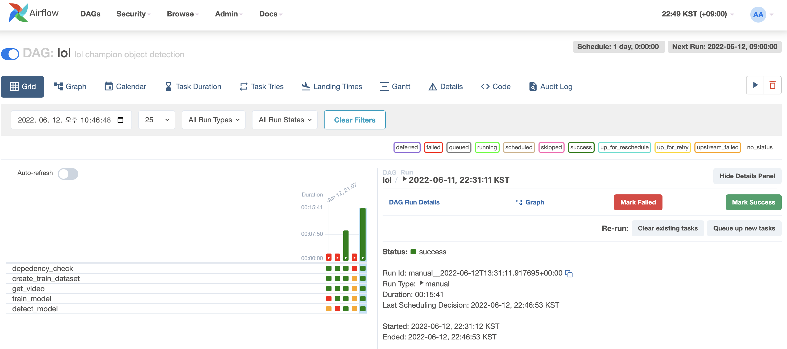

# LOL Object Detection Airflow

[해당 프로그램](https://github.com/choseungje/lol_object_detection)과 기능은 동일하며 [Airflow](https://airflow.apache.org/docs/)를 적용한 버전입니다.

## Airflow 도입 목적
[기존 프로그램](https://github.com/choseungje/lol_object_detection)에서의 Data Pipeline은 아래와 같습니다.

1. 훈련 데이터셋 생성
2. Youtube에서 mp4 다운로드
3. Object Detection Model Training
4. LOL champine Object Detection

- [x] 기존에도 Task를 분리시켜 script 파일을 만들어 실행시켰지만, Airflow를 도입해 보다 뚜렷한 Task의 구분을 목표.
- [ ] 훈련 데이터셋 생성, mp4 다운로드는 순차적으로 수행될 필요가 없고, Training을 위해선 2개의 Task가 모두 완료되어야 하기 때문에 병렬로 수행을 목표

GPU를 연결하지 않아 훈련 및 추론 속도가 느립니다. 따라서 빠른 실행을 위해 훈련 데이터 개수, Epochs = 1, mp4 영상 길이는 3분으로 조절했습니다.

롤 챔피언 디텍션의 좋은 성능을 원한다면 [여기](https://github.com/choseungje/lol_object_detection)에서 실행시켜주세요.

## ENV

Airflow 서버를 올립니다.

```shell
# 컨테이너와 마운팅될 디렉토리 생성
mkdir -p ./logs ./plugins

# 호스트, 컨테이너 파일 권한 설정
echo -e "AIRFLOW_UID=$(id -u)\nAIRFLOW_GID=0" > .env

docker build -t local/test:latest -f Dockerfile .

docker-compose up airflow-init
docker-compose up -d
```

## RUN

http://localhost:8081/ 에 접근합니다.
Username, Password 모두 `airflow` 입니다.

아래 사진처럼 lol dag를 클릭합니다.


이후 Trigger DAG를 실행시키면 모든 task가 실행되며 Grid 창에서 진행 상태 및 결과를 확인하실 수 있습니다.


## Airflow Server Down

```shell
docker-compose down
```
